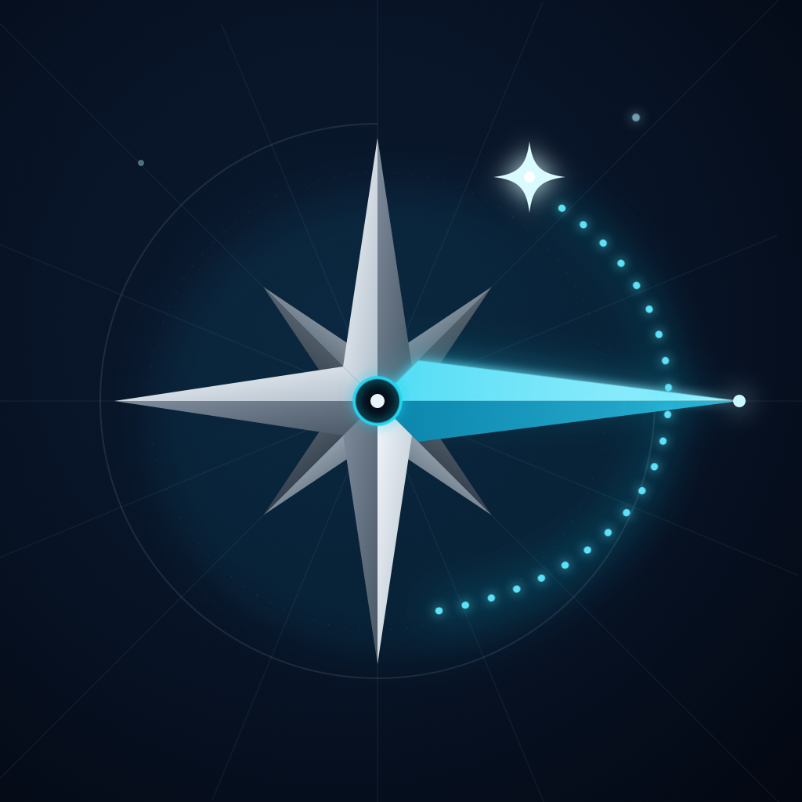

<p align="center">
  
</p>

# Marco Polo

**Open-source travel companion for your desktop.** Search flights, hotels and
experiences; plan day-by-day itineraries; and let your own AI do the work —
no new subscriptions, no API keys required for local or CLI connectors.

Built with [Tauri v2](https://tauri.app) (Rust) + [Next.js](https://nextjs.org)
(React, TypeScript, Tailwind) + [Supabase](https://supabase.com). MIT licensed.

## Download

Get the latest build from [marcopolo.bookvibe.app](https://marcopolo.bookvibe.app)
or build from source below.

| Platform | Status |
| --- | --- |
| macOS (Apple Silicon & Intel) | ✅ Available |
| Windows | 🚧 Coming soon |
| Linux (AppImage, .deb, .rpm) | 🚧 Coming soon |

## Features

| Feature | Status | Provider |
| --- | --- | --- |
| Ask Marco (AI chat) | ✅ MVP | Claude Code, Kimi Code, Claude Desktop, Kimi, Ollama, your API key |
| Flight search | ✅ MVP | Duffel |
| Hotel search | ✅ MVP | LiteAPI (Nuitee) |
| Experiences | 🚧 Roadmap | Viator |
| Itinerary builder | 🚧 Roadmap | — |
| Budget tracker | 🚧 Roadmap | — |
| Photo gallery | 🚧 Roadmap | Supabase Storage |
| AI journal | 🚧 Roadmap | Claude Vision |
| Travel agent messaging | 🚧 Roadmap | Supabase Realtime |

**No API keys? No problem.** Marco Polo ships with a demo mode that generates
realistic sample data locally, so you can explore and develop every feature
without signing up for anything.

## Getting started

### Prerequisites

- [Node.js](https://nodejs.org) ≥ 20 and [pnpm](https://pnpm.io) ≥ 10
- [Rust](https://rustup.rs) (stable)
- Platform build tools:
  - **macOS**: Xcode Command Line Tools (`xcode-select --install`)
  - **Windows**: [Microsoft C++ Build Tools](https://visualstudio.microsoft.com/visual-cpp-build-tools/) + [WebView2](https://developer.microsoft.com/microsoft-edge/webview2/) (preinstalled on Windows 11)

### Run in development

```bash
git clone https://github.com/ovixis/marcopolo.git
cd marcopolo
pnpm install
pnpm tauri dev
```

That starts the Next.js dev server and opens the desktop window with hot reload
on both the frontend and the Rust backend.

### Build installers

```bash
pnpm tauri build
```

Produces a `.dmg`/`.app` on macOS and `.msi`/`.exe` installers on Windows,
under `src-tauri/target/release/bundle/`.

## Connect your AI

Marco Polo doesn't sell AI access. It connects to the AI you already use:

- **CLI agent**: auto-detects Claude Code or Kimi Code installed on your Mac
- **Desktop bridge**: drives Claude Desktop or Kimi.app you're already signed into
- **Local model**: auto-detects Ollama, LM Studio, Jan or llama.cpp
- **Your API key**: Claude, OpenAI, Grok, Kimi or any OpenAI-compatible endpoint

The key stays on your device and is sent only to the model provider you chose.

## Configuration

Copy `.env.example` to `.env` and fill in the services you want. Everything is
optional — missing keys simply keep that feature in demo mode.

| Variable | Purpose |
| --- | --- |
| `DUFFEL_API_KEY` | Real flight search. Free test-mode keys at [app.duffel.com](https://app.duffel.com) |
| `LITEAPI_API_KEY` | Real hotel search. Keys at [liteapi.travel](https://liteapi.travel) |
| `NEXT_PUBLIC_SUPABASE_URL` / `NEXT_PUBLIC_SUPABASE_ANON_KEY` | Auth, trips database, photo storage |
| `ANTHROPIC_API_KEY` | AI journal synthesis (roadmap) |

## Architecture

```
┌────────────────────────────────────────────────┐
│ Tauri shell (Rust)                             │
│  • Provider API clients (Duffel, LiteAPI, …)   │
│  • API keys stay in the native process         │
│  • Demo-mode data generation                   │
│    ▲ typed IPC commands                        │
│    ▼                                           │
│ Next.js static export (React + TypeScript)     │
│  • Tailwind + custom components                │
│  • Supabase JS client (auth/db/storage)        │
└────────────────────────────────────────────────┘
```

- Provider credentials live only in the Rust process — they are never shipped
  to the webview.
- The frontend is a fully static Next.js export; the same UI runs in a plain
  browser (`pnpm dev`) with sample data for fast UI iteration.
- Domain types are mirrored between `src/lib/types/` (TypeScript) and
  `src-tauri/src/types.rs` (Rust) — keep them in sync when contributing.

## Contributing

We'd love your help. See [CONTRIBUTING.md](CONTRIBUTING.md) for the dev
workflow, project layout, and how to pick up an issue. Good first areas:

- Experiences (Viator) provider client
- Itinerary drag-and-drop builder
- Budget tracker with multi-currency support
- Windows and Linux release builds

## Design

The visual system is documented in [DESIGN.md](DESIGN.md). The product context
and brand voice live in [PRODUCT.md](PRODUCT.md). We use
[impeccable](https://impeccable.style/) to keep the UI free of AI slop.

## License

[MIT](LICENSE) © Marco Polo contributors
